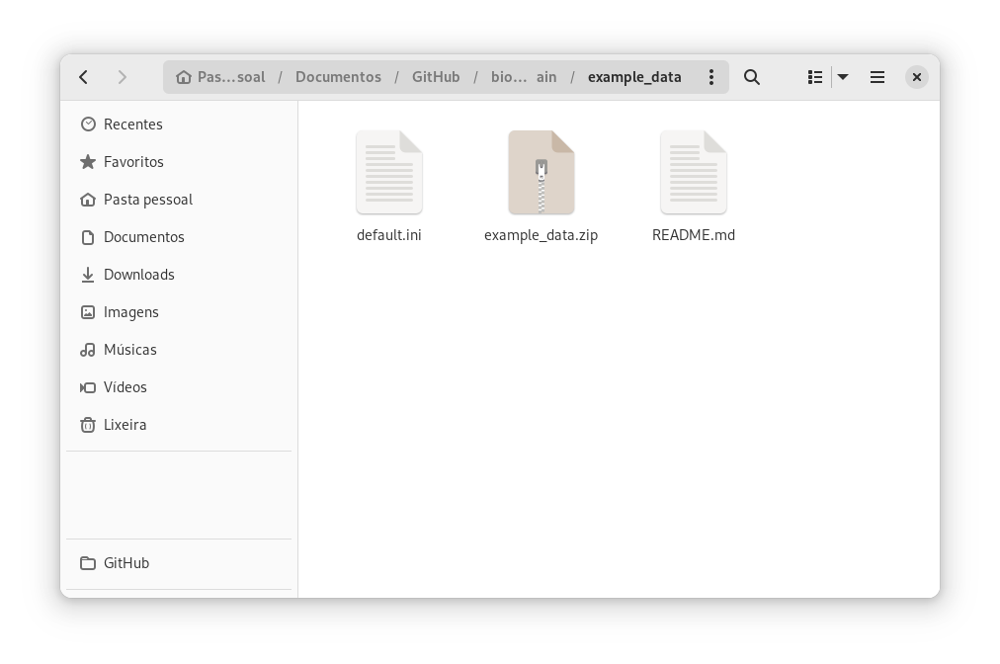
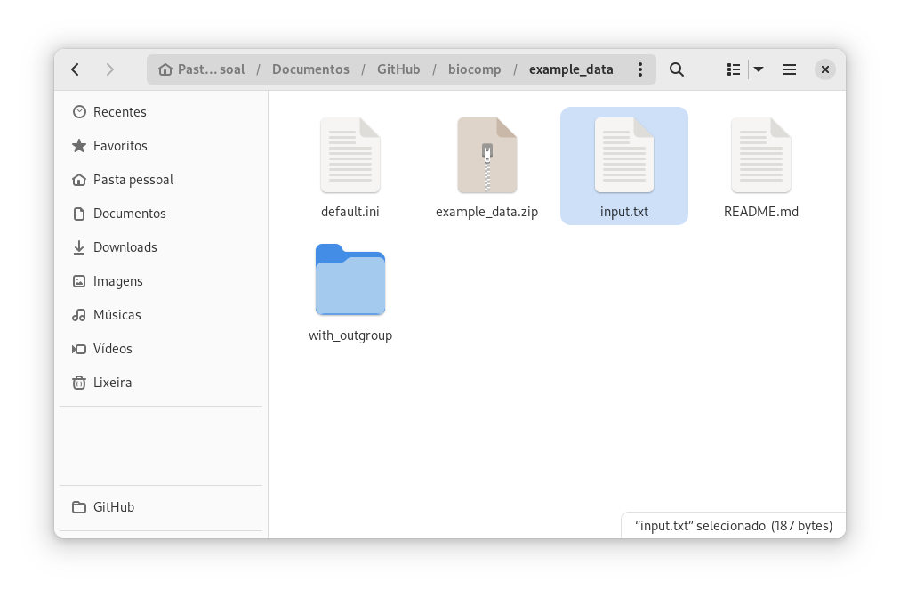

# Framework for construction of phylogenetic networks on High Performance Computing (HPC) environment

## Introduction

Phylogeny refers to the evolutionary history and relationship between biological lineages related by common descent. Reticulate evolution refers to the origination of lineages through the complete or partial merging of ancestor lineages. Networks may be used to represent lineage independence events in non-treelike phylogenetic processes.

The methodology for reconstructing networks is still in development. Here we explore two methods for reconstructing rooted explicit phylogenetic networks, PhyloNetworks and Phylonet, which employ computationally expensive and time consuming algorithms. The construction of phylogenetic networks follows a coordinated processing flow of data sets analyzed and processed by the coordinated execution of a set of different programs, packages, libraries or pipelines, called workflow activities. 

In view of the complexity in modeling network experiments, the present work introduces a workflow for phylogenetic network analyses coupled to be executed in High-Performance Computing (HPC) environments. The workflow aims to integrate well-established software, pipelines and scripts, implementing a challenging task since these tools do not consistently profit from the HPC environment, leading to an increase in the expected makespan and idle computing resources.

## Requirements

1. Python >= 3.8
   1. Biopython >= 1.75
   2. Pandas >= 1.3.2
   3. Parsl >= 1.0
3. Raxml >= 8.2.12
4. Astral  >= 5.7.1
5. SnaQ (PhyloNetworks) >= 0.13.0
6. MrBayes >= 3.2.7a
7. BUCKy >=  1.4.4
8. Quartet MaxCut >= 2.10
9. PhyloNet >= 3.8.2
10. Julia >= 1.4.1
11. IQTREE >= 2.0


## How to use

### Setting up the framework

The framework uses a file to get all the needed parameters. For default it loads the file *default.ini* in the config folder, but you can explicitly load other files using the argument ``-s name_of_the_file``, *e.g.* ``-s config/test.ini``.

* Edit *parl.env* with the environment variables you may need, such as modules loadeds in SLURM
* Edit *work.config* with the directories of your phylogeny studies (the framework receives as input a set of homologous gene alignments of species in the nexus format).
* Edit *default.ini* with the path for each of the needed softwares and the parameters of the execution provider.

For default, the execution logs are created in the ``runinfo`` folder. To change it you can use the `-r folder_path` parameter.

#### Contents of the configuration file

* General settings

```ini
[GENERAL]
ExecutionProvider = SLURM
ScriptDir 		= ./scripts
Environ			= config/parsl.env
Workload		= config/work.config
NetworkMethod   = MP
TreeMethod      = RAXML
BootStrap       = 1000
```

1. The framework can be executed in a HPC environment using the Slurm resource manager using the parameter ``ExecutionProvider`` equals to ``SLURM`` or locally with ``LOCAL``. 
2. The path of the scripts folder is assigned  in ``ScriptDir``. It's recommended to use the absolute path to avoid errors.
3. The ``Environ`` parameter contains the path of the file used to set environment variables. More details can be seen below.
4. In ``Workload`` is the path of the experiments that will be performed.
5. ``NetworkMethod`` and ``TreeMethod`` are the default network and tree methods that will be used to perform the workloads' studies.
6. ``Bootstrap`` is the parameter used in all the software that use bootstrap (RAxML, IQTREE and ASTRAL)

* Workflow execution settings
 
  When using SLURM, these are the needed parameters:
  ```ini
  [WORKFLOW]
  Monitor			= False
  PartCore	= 24
  PartNode	= 1
  Walltime	= 00:20:00
  ```

  1. ``Monitor`` is a parameter to use parsl's monitor module in HPC environment. It can be *true* or *false*. If you want to use it, it's necessary to set it as *true* and manually change the address in ``infra_manager.py``
  2. If you are using it in a HPC environment (using SLURM), the framework is going to submit in a job. ``PartCore`` is the number of cores of the node; ``PartNode`` is the number of nodes of the partition; and the ``Walltime`` parameter is the maximum amount of time the job will be able to run.

  However, if the the desired execution method is the LocalProvider, _i.e._ the execution is being performed in your own machine, only these parameters are necessary:

  ```ini
  [WORKFLOW]
  Monitor			= False
  MaxCore	= 6
  CoresPerWorker	= 1

  ```

* RAxML settings

  ```ini
  [RAXML]
  RaxmlExecutable = raxmlHPC-PTHREADS
  RaxmlThreads 	= 6
  RaxmlEvolutionaryModel = GTRGAMMA --HKY85
  ```

* IQTREE settings

  ```ini
  [IQTREE]
  IqTreeExecutable = iqtree2
  IqTreeEvolutionaryModel = TIM2+I+G 
  IqTreeThreads = 6
  ```

* ASTRAL settings

  ```ini
  [ASTRAL]
  AstralExecDir 	= /opt/astral/5.7.1
  AstralJar 		= astral.jar
  ```

* PhyloNet settings

  ```ini
  [PHYLONET]
  PhyloNetExecDir 	= /opt/phylonet/3.8.2/
  PhyloNetJar 		= PhyloNet.jar
  PhyloNetThreads     = 6
  PhyloNetHMax        = 3
  PhyloNetRuns        = 5
  ```

* SNAQ settings

  ```ini
  [SNAQ]
  SnaqThreads		= 6
  SnaqHMax        = 3
  SnaqRuns        = 3
  ```

* Mr. Bayes settings

  ```ini
  [MRBAYES]
  MBExecutable	= mb
  MBParameters	= mcmcp ngen=100000 burninfrac=.25 samplefreq=50 printfreq=10000 diagnfreq=10000 nruns=2 nchains=2 temp=0.40 swapfreq=10
  ```

* Bucky settings

  ```ini
  [BUCKY]
  BuckyExecutable = bucky
  MbSumExecutable = mbsum
  ```

* Quartet MaxCut

  ```ini
  QUARTETMAXCUT]
  QmcExecDir       = /opt/quartet/
  QmcExecutable    = find-cut-Linux-64
  ```

#### Workload file

For default the workload file is ``work.config`` in the *config* folder. The file contains the absolute paths of the experiment's folders.

```
/home/rafael.terra/Biocomp/data/Denv_1
```

You can comment folders using the # character in the beginning of the path. *e. g.* ``#/home/rafael.terra/Biocomp/data/Denv_1``. That way the framework won't read this path.

You can also run a specific flow for a path using ``@TreeMethod|NetworkMethod`` in the end of a path. Where *TreeMethod* can be RAXML, IQTREE or MRBAYES and *NetworkMethod* can be MPL or MP (case sensitive). The supported flows are: ``RAXML|MPL``, ``RAXML|MP``, ``IQTREE|MPL``, ``IQTREE|MP`` and ``MRBAYES|MPL``. For example:

```
/home/rafael.terra/Biocomp/data/Denv_1@RAXML|MPL
```

#### Environment file

The environment file contains all the environment variables (like module files used in SLURM) used during the framework execution. Example:

```sh
module load python/3.8.2
module load raxml/8.2_openmpi-2.0_gnu
module load java/jdk-12
module load iqtree/2.1.1
module load bucky/1.4.4
module load mrbayes/3.2.7a-OpenMPI-4.0.4
source /scratch/app/modulos/julia-1.5.1.sh
```

#### Experiment folder

Each experiment folder needs to have a *input folder* containing a *.tar.gz* compressed file and a *.json* with the following content. **The framework considers that there is only one file of each extension in the input folder**.

```json
{
	"Mapping":"",
	"Outgroup":""
}
```

Where ``Mapping`` is a direct mapping of the taxon, when there are multiple alleles per species, in the format ``species1:taxon1,taxon2;species2:taxon3,taxon4`` *(white spaces are not supported)* and ``Outgroup`` is the taxon used to root the network. The Mapping parameter is optional (although it has to be in the json file without value), but the outgroup is obligatory. It's important to say that the flow *MRBAYES|MPL* doesn't support multiple alleles per species. Example:

```json
{
  "Mapping": "dengue_virus_type_2:FJ850082,FJ850088,JX669479,JX669482,JX669488,KP188569;dengue_virus_type_3:FJ850079,FJ850094,JN697379,JX669494;dengue_virus_type_1:FJ850073,FJ850084,FJ850093,JX669465,JX669466,JX669475,KP188545,KP188547;dengue_virus_type_4:JN559740,JQ513337,JQ513341,JQ513343,JQ513344,JQ513345,KP188563,KP188564;Zika_virus:MH882543", 
  "Outgroup": "MH882543"
}
```


## Running the framework

* In a local machine:

  After setting up the framework, just run ``python3 parsl_workflow.py``.
  
* In a SLURM environment:

  Create an submition script that inside contains: ``python3 parsl_workflow.py``.

  ```sh
  #!/bin/bash
  #SBATCH --time=15:00:00
  #SBATCH -e slurm-%j.err
  #SBATCH -o slurm-%j.out
  module load python/3.9.6
  cd /path/to/biocomp
  python3 parsl_workflow.py
  ```

The framework is under heavy development. If you notice any bug, please create an issue here on GitHub.

### Running in a DOCKER container

The framework is also available to be used in Docker. It can be built from source or pushed from DockerHub.

#### Building it from the source code

Adapt the default settings file ``config/default.ini`` according to your machine, setting the number of threads and bootstrap. After that, run ``docker build -t hp2net .`` in the project's root folder.

#### Downloading it from Dockerhub

The docker image can also be downloaded from [Docker hub](https://hub.docker.com/repository/docker/rafaelstjf/hp2net/general). To do that, just run the command ``docker pull rafaelstjf/hp2net:main``

#### Running

The first step to run the framework is to setup your dataset. To test if the framework is running without problems in your machine, you can use the [example datasets](example_data).



Extracting the ``example_data.zip`` file, a new folder called ``with_outgroup`` is created. This folder contain four datasets of DENV sequences.

The next step is the creation of the settings and workload files. For the settings file, download the [default.ini](config/default.ini) from this repository and change it to you liking (the path of all software are already configured to run on docker). The workload file is a text file containing the absolute path of the datasets, followed by the desired pipeline, as shown before in this document. Here for example purposes, the ``input.txt`` file was created.



With all the files prepared, the framework can be executed from the ``example_data`` folder as following:

``docker run --rm -v $PWD:$PWD rafaelstjf/hp2net:main -s $PWD/default.ini -w $PWD/input.txt``

**Important:** the docker doesn't save your logs, for that add the parameter: ``-r $PWD/name_of_your_log_folder``.

---
If you are running it on **Santos Dumont Supercomputer**, both downloading and execution of the docker container need to be performed from a submission script and executed using ``sg docker -c "sbatch script.sh"``. The snippet below shows an example of submission script.

```sh
#!/bin/bash
#SBATCH --nodes=1
#SBATCH --ntasks-per-node=24
#SBATCH -p cpu_small
#SBATCH -J Hp2NET
#SBATCH --exclusive
#SBATCH --time=02:00:00
#SBATCH -e slurm-%j.err
#SBATCH -o slurm-%j.out

DIR='/scratch/pcmrnbio2/rafael.terra/WF_parsl/example_data'
docker  pull rafaelstjf/hp2net:main

docker run --rm -v $DIR:$DIR rafaelstjf/hp2net:main -s ${DIR}/sdumont.ini -w ${DIR}/entrada.txt -r ${DIR}/logs
```

## If you use it, please cite

Terra, R., Coelho, M., Cruz, L., Garcia-Zapata, M., Gadelha, L., Osthoff, C., ... & Ocana, K. (2021, July). Gerência e Análises de Workflows aplicados a Redes Filogenéticas de Genomas de Dengue no Brasil. In *Anais do XV Brazilian e-Science Workshop* (pp. 49-56). SBC.

**Also cite all the coupled software!**

